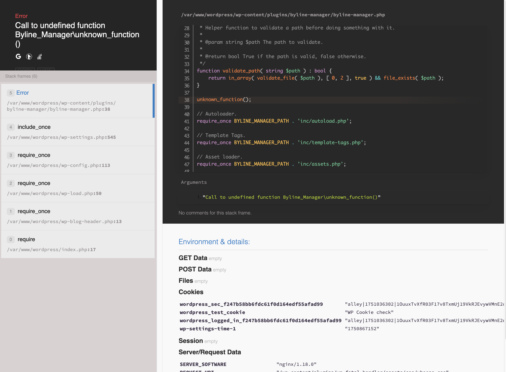
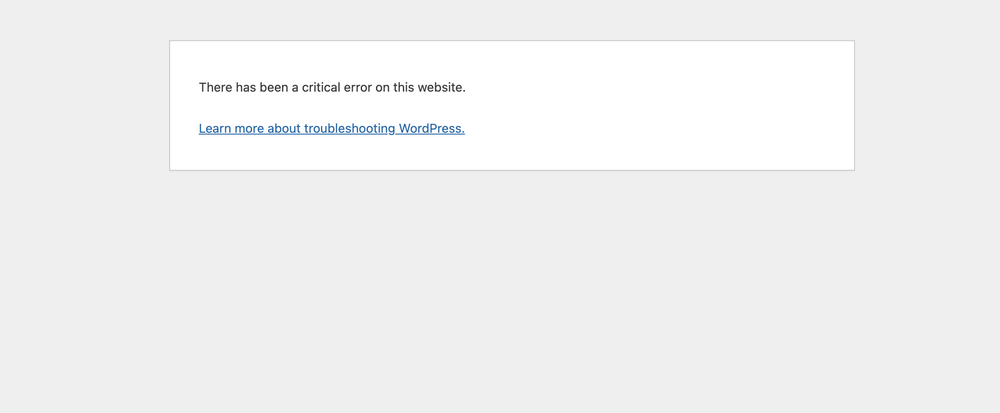

# WP Fatal Error Handler

Contributors: alleyinteractive

Tags: alleyinteractive, wp-fatal-handler

Stable tag: 0.1.1

Requires at least: 6.3

Tested up to: 6.7

Requires PHP: 8.2

License: GPL v2 or later

[](https://github.com/alleyinteractive/wp-fatal-handler/actions/workflows/all-pr-tests.yml)

A better fatal error handler for WordPress powered by
[Whoops](https://github.com/filp/whoops).



By default, WordPress' error handling provides limited information when dealing with
fatal errors.



This plugin replaces the default WordPress fatal error handler with a Whoops
error handler, which provides a much more useful error page with stack traces,
code snippets, and more. It also provides a JSON response for API requests. The
Whoops handler will only be applied to fatal errors where `WP_DEBUG` is set to
`true.

## Installation

You can install the package via Composer:

```bash
composer require alleyinteractive/wp-fatal-handler
```

## Usage

Activate the plugin in WordPress and it will automatically register the Whoops
error handler for fatal errors. It is recommended to load this plugin as early
as possible (perhaps in `mu-plugins`), so that it can catch all fatal errors
that occur during the WordPress bootstrap process.

## Configuration

By default the plugin will register the Whoops error handler and only handle
fatal errors (where core usually displays `There has been a critical error on
this website.` ).

To disable the registration of the error handler, you can use the
`wp_fatal_handler_register` filter:

```php
add_filter( 'wp_fatal_handler_register', '__return_false' );
```

**Note:** this filter should be applied before the plugin is loaded.

## Changelog

Please see [CHANGELOG](CHANGELOG.md) for more information on what has changed recently.

## Credits

This project is actively maintained by [Alley
Interactive](https://github.com/alleyinteractive). Like what you see? [Come work
with us](https://alley.com/careers/).

- [Sean Fisher](https://github.com/srtfisher)
- [All Contributors](../../contributors)

## License

The GNU General Public License (GPL) license. Please see [License File](LICENSE) for more information.
